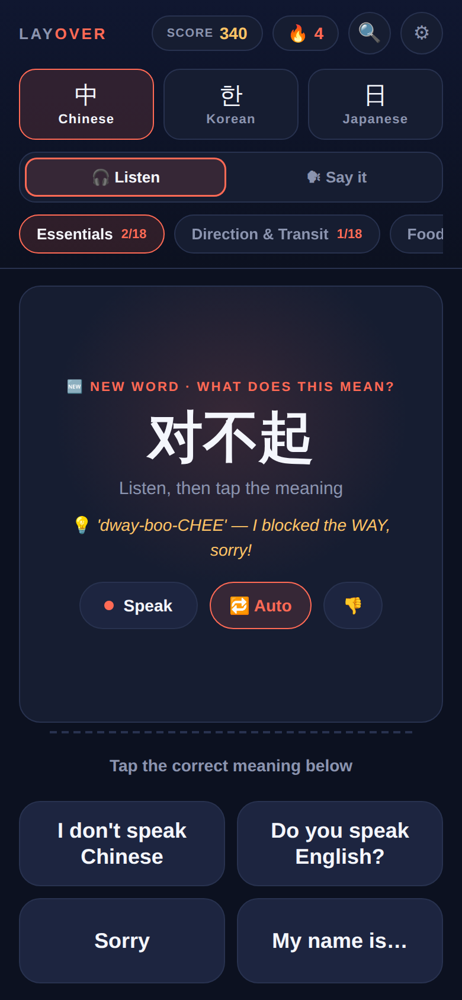
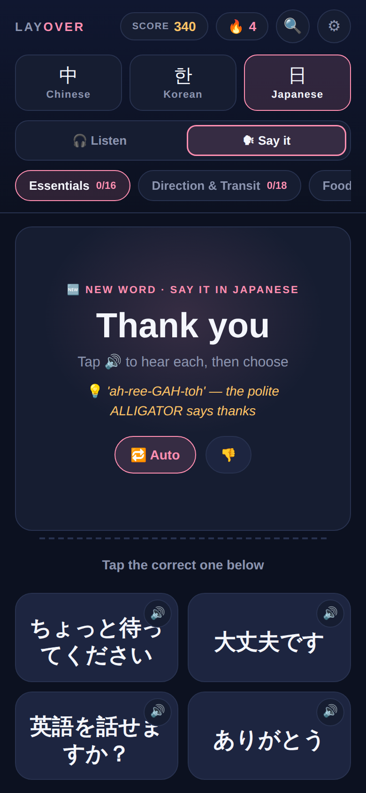
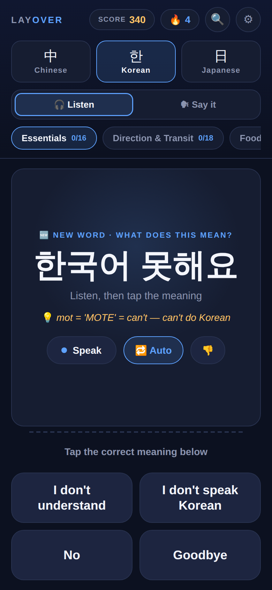
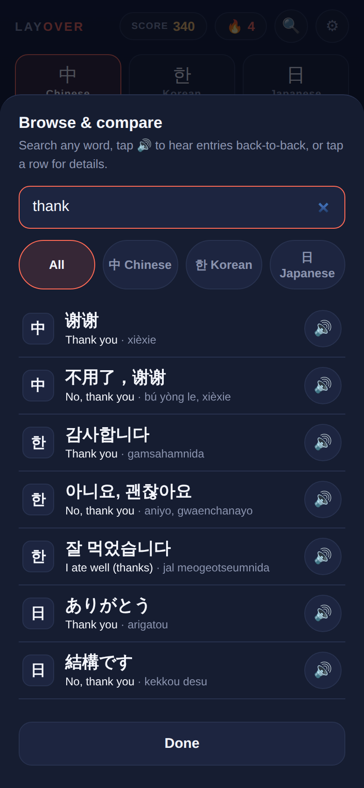
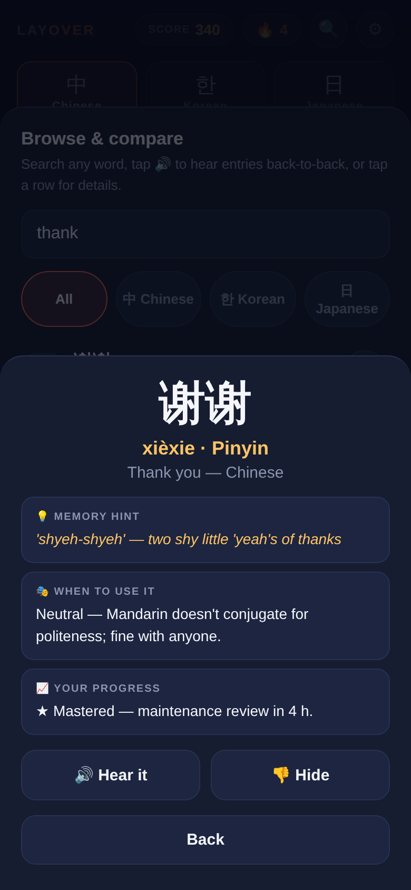
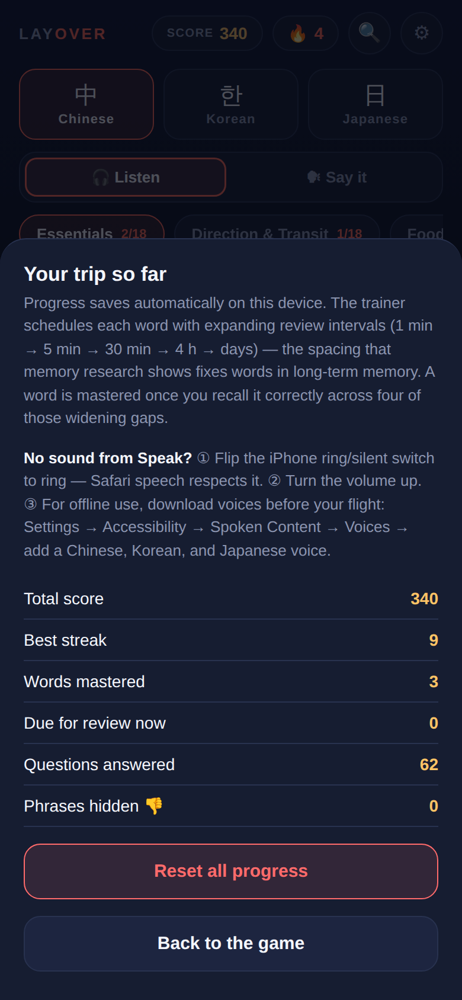

# Layover

**Learn enough Chinese, Korean, or Japanese to get through the airport — on the plane, offline, in twenty minutes.**

[](https://github.com/daniels98it/layOver/actions/workflows/ci.yml)
[](LICENSE)
[](https://daniels98it.github.io/layOver/)
[](#architecture)

Layover is a survival-phrase trainer for travellers with a stopover and no data plan. It drills roughly 70 phrases per language — greetings, directions, ordering food, numbers, emergencies — using speech synthesis for the audio and a spaced-repetition scheduler that decides what you see next. It installs to a home screen, runs with the radio off, and keeps your progress on the device.

No build step, no bundler, no dependencies. It's HTML, CSS, and three JavaScript files served as-is.

## Screenshots

<table>
  <tr>
    <td align="center"><br><sub><b>Listen</b> — hear it, pick the meaning</sub></td>
    <td align="center"><br><sub><b>Say it</b> — every option is audible</sub></td>
    <td align="center"><br><sub>Each language has its own accent</sub></td>
  </tr>
  <tr>
    <td align="center"><br><sub><b>Browse</b> — compare all three at once</sub></td>
    <td align="center"><br><sub>Register, mnemonic, review state</sub></td>
    <td align="center"><br><sub>Progress, mastery, hidden phrases</sub></td>
  </tr>
</table>

## Features

**Two game modes, both built around sound**

- **🎧 Listen** — the native script appears and is spoken aloud; you pick the English meaning.
- **🗣 Say it** — the English appears; you pick the correct written form. Every option carries its own 🔊 so you can hear the candidates before committing.

**Speech**

- Web Speech API with the correct locale per language (`zh-CN`, `ko-KR`, `ja-JP`) and a voice matched from the device's installed set, falling back through exact locale → locale prefix → language.
- Playback is slowed to `rate 0.8`, which is where mimicry actually works.
- An **auto-play** toggle speaks each new listening prompt without a tap, and the setting is remembered.
- iOS-specific handling throughout: speech is unlocked from the first user gesture, utterances are held in a live reference so Safari can't garbage-collect them mid-sentence, and a silent-failure watchdog tells you when the device simply has no voice for that language instead of failing quietly.

**Spaced repetition**

- Seven expanding intervals — 30s → 1m → 5m → 30m → 4h → 3d → 7d — with each phrase in a Leitner-style box. A correct answer promotes the phrase and pushes its next review further out; a miss drops it to box 0 and brings it back in about thirty seconds for relearning.
- The scheduler prefers phrases whose review is **due**, then introduces a new phrase only while fewer than six are still in the learning phase, and otherwise serves whatever comes up soonest — so play never stalls.
- **Mastery at four stages**: a phrase is marked mastered once you've recalled it correctly across four widening gaps, not after four answers in a row.
- Module chips show mastered-vs-total per topic; the progress sheet reports score, best streak, words mastered, and how many are due right now.

**Memory aids**

- **Keyword mnemonics** for every phrase, shown automatically on first exposure — the first encounter is treated as a study trial, not a test — then hidden so later encounters force real retrieval. A 💡 Hint button brings one back on demand, and the mnemonic is always revealed after you answer.
- **Production effect**: after each answer the phrase is replayed and you're prompted to repeat it aloud, romanization on screen.

**Curation**

- 👎 hides any phrase you'll never need; it leaves rotation immediately and stops counting against a module's total. Hidden phrases are counted in the settings sheet and restorable in one tap, individually from the detail view or all at once.

**Browse & compare**

- Search across all three languages at once by English, native script, or romanization — useful for seeing how 谢谢 / 감사합니다 / ありがとう line up.
- Filter to a single language, or tap 🔊 down a list of results to hear them back to back.
- Tap any row for a **detail view**: pronunciation with the right label per language (Pinyin / Romanization / Romaji), the memory hint, a **formality register** note — Korean `-hamnida` vs `-yo`, Japanese `desu/masu`, with hand-written overrides where the nuance matters (不好意思 vs 对不起, ありがとう vs ありがとうございます) — and your own review state for that phrase, including when it comes up next.

**The rest**

- Score with a streak bonus, streak and best-streak tracking, synthesized Web Audio feedback tones (including a distinct mastery chime).
- Full offline PWA: installable, standalone display, portrait-locked, safe-area aware, and it picks up new deploys on its own.
- `prefers-reduced-motion` respected; buttons are keyboard-focusable with visible focus rings; sheets are labelled dialogs.

## The science

The design follows four findings that replicate well, rather than gamification for its own sake.

- **Spacing effect / expanding retrieval** — spaced review beats massed practice by a wide margin; what matters most is the *total* spacing, and an expanding schedule is a practical way to get it while keeping early reviews close enough to succeed. The graduated-interval shape is the one Pimsleur built language audio around. ([Pimsleur 1967](https://doi.org/10.1111/j.1540-4781.1967.tb06700.x); [Karpicke & Bauernschmidt 2011](https://doi.org/10.1037/a0023436))
- **Retrieval practice / the testing effect** — being made to *produce* an answer strengthens memory far more than restudying it. Every trial in Layover is a retrieval attempt, which is why the mnemonic hides itself after first exposure. ([Roediger & Karpicke 2006](https://doi.org/10.1111/j.1467-9280.2006.01693.x))
- **Keyword mnemonics** — pairing a foreign word with a similar-sounding native "keyword" plus an image roughly doubles vocabulary acquisition, and works best when supplied at first exposure. Every phrase here ships with one. ([Atkinson & Raugh 1975](https://doi.org/10.1037/0278-7393.1.2.126))
- **Production effect** — words spoken aloud are remembered better than words read silently. Hence the "repeat it aloud" echo after every answer, and the option-level audio in Say-it mode. ([MacLeod et al. 2010](https://doi.org/10.1037/a0018785))

## Getting started

**On the web** — open [daniels98it.github.io/layOver](https://daniels98it.github.io/layOver/), if GitHub Pages is enabled for the repository.

**Locally** — clone or download the repo and open `index.html` in a browser. Everything works from the file system except the service worker, which needs `http(s)`; see [Development](#development) to serve it properly.

**Install on iPhone** (do this before you fly):

1. Open the page in **Safari** — not Chrome; only Safari can add to the home screen.
2. Tap **Share** → **Add to Home Screen** → **Add**.
3. Launch it once from the home screen while still online, so the service worker caches everything.

**Get the voices on the device.** Speech synthesis on iOS falls back to a server voice unless a local one is installed, which means no audio in the air. Before you leave: **Settings → Accessibility → Spoken Content → Voices** and download a Chinese, Korean, and Japanese voice.

**No sound?** Flip the ring/silent switch to ring — Safari's speech respects it — and check the volume. If a language stays silent, the app will tell you the device has no voice for it.

## Architecture

| Path | Role |
| --- | --- |
| `index.html` | Markup and the app shell — header, card, answer grid, three bottom sheets. No inline logic. |
| `css/styles.css` | The whole stylesheet. A CSS-custom-property token system ("cabin night"); `--accent` is swapped at runtime per language. |
| `js/data.js` | Content only: `LANGS`, `MODULES`, and the `DICT` of phrases. Where you add vocabulary. |
| `js/app.js` | Everything that runs: persistence, the SRS scheduler, speech, audio, game loop, rendering, browse and detail views. Carries `APP_VERSION`. |
| `sw.js` | Service worker. Caches the app for offline use; `CACHE_VERSION` gates cache busting. |
| `manifest.json` | PWA metadata — name, icons, standalone display, portrait orientation, theme colour. |
| `docs/screenshots/` | The images in this README. |

**Zero build.** There is no bundler, transpiler, package manager, or dependency. Files are served exactly as they are written, which means the repository is deployable by copying it to any static host, and debugging in the browser shows you the source you wrote. Scripts load in order — `data.js` then `app.js` — as plain classic scripts.

**Service worker strategy.** HTML is **network-first**: online you always get the freshly deployed page, and the cached copy is refreshed behind it; offline you fall back to cache. Everything else — CSS, JS, icons, manifest — is **cache-first**, for an instant cold start with the radio off. On top of that, the page calls `registration.update()` at launch and whenever it returns to the foreground, and reloads once when a new worker takes control, so an installed PWA picks up deploys without the user reinstalling it.

**Persistence.** All state lives in one `localStorage` key (`layover_progress_v1`): score, streaks, per-phrase correct counts, mastery flags, hidden phrases, SRS boxes and due dates, and the mode/auto-play preferences. Every read and write is wrapped, with an in-memory fallback so the app still plays when storage is blocked — sandboxed previews, private-mode quirks — it just won't survive a reload. Nothing is sent anywhere; there is no backend and no analytics.

## Development

Serve the directory over HTTP so the service worker registers:

```bash
python3 -m http.server 8000
# or
npx serve .
```

Then open <http://localhost:8000>. When iterating on the service worker, use DevTools → Application → Service Workers → *Update on reload*, or hard-reload; otherwise the cached copy will outlive your edits.

**Tests.** A dependency-free smoke test runs the app's invariants under Node:

```bash
node tests/smoke.mjs
```

It runs on every push and pull request via GitHub Actions (`.github/workflows/ci.yml`).

**When you change assets, bump `CACHE_VERSION` in `sw.js`.** HTML is network-first so page edits propagate on their own, but CSS, JS, and icons are cache-first — an installed phone will keep serving the old ones until the cache name changes. Bump `APP_VERSION` in `js/app.js` alongside it; the settings sheet displays it, which makes "which build is this phone running?" answerable.

## Contributing

Contributions are welcome — especially phrases that a real traveller actually needed and this app didn't have.

Adding vocabulary is the easiest place to start. Open `js/data.js`, find the language and module, and add an entry:

```js
{en:"Where is the gate?", native:"登机口在哪里？", roman:"dēngjīkǒu zài nǎlǐ", mn:"dēngjī = 'boarding' — the DING! before boarding"}
```

All four fields are required: `en` (English), `native` (the written form), `roman` (romanization), and `mn` (a keyword mnemonic — sound-alike bridges beat literal glosses). Keep phrases short enough to say to a stranger.

For anything larger, open an issue first so we can agree on the shape. Pull requests run CI automatically; please check that the smoke test passes and that the app still works with the network throttled to offline.

## License

[MIT](LICENSE) © 2026 Daniel Crazzolara
